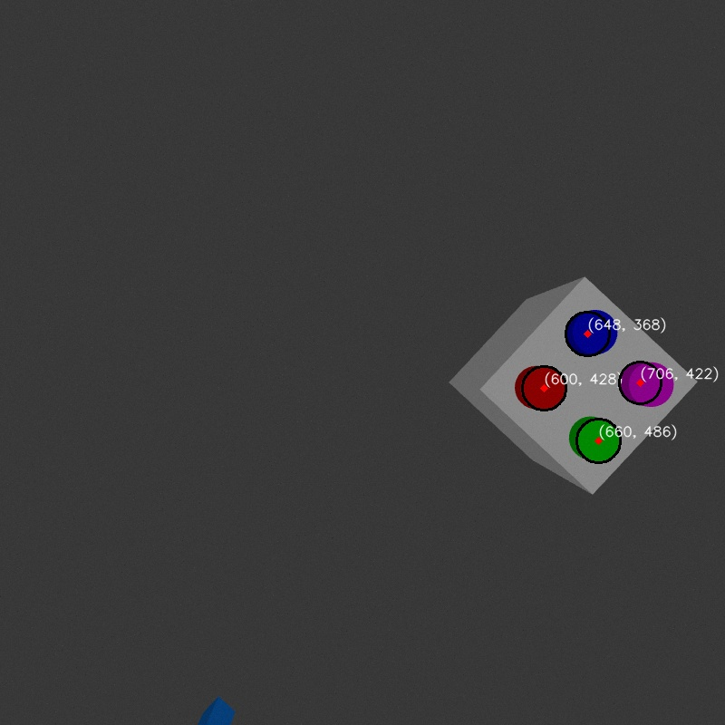
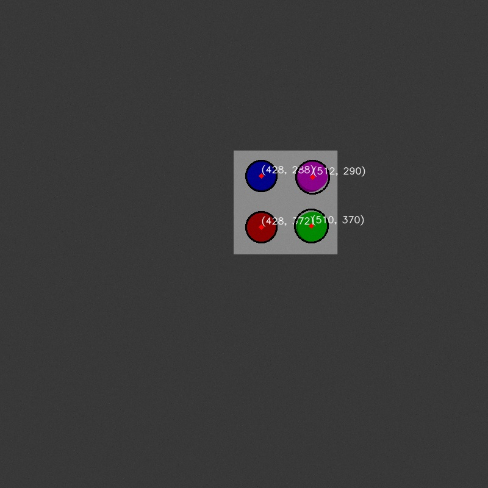
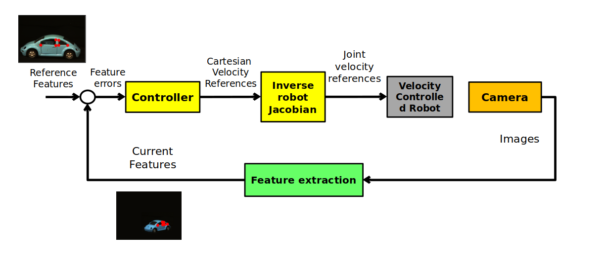

# Implementing a visual servoing algorithm for a 2 DOF robot in ROS2.

This project focuses on implementing visual feedback manipulation on a 2-DOF planar robotic manipulator in Gazebo. The manipulator interacts with an object, modeled as a cube with four circles. The visual servoing algorithm leverages four point features (the centers of the circles) to move the robot between different image configurations.

Circle centers are detected using two methods:

1) Mean Color Thresholding
2) Hough Circle Transforms

The robot operates using two controllers:

**Position Controller:**  Ensures that the entire object remains visible within the camera's view, marking the desired configuration.

**Velocity Controller:**  Fine-tunes the robot's movements to perform visual servoing and align the object with the target image configuration.

In the new location, the full object remains visible, allowing seamless manipulation through the virtual camera.

# Overview 

The robot is first moved to the desired configuration using the position controller, where the circle center detection algorithm is executed. The detected centers are then saved as reference points for the Image-Based Visual Servoing (IBVS) control loop. Next, the robot is moved to the initial configuration. The goal is to transition the robot from this initial state to the predefined desired configuration by tracking the detected feature points' trajectories through visual feedback. The IBVS algorithm is run with 𝑓 = 𝑍 = 1 to compute the required joint velocities, and the robot is then moved using the velocity controller based on these calculations.

  
  

  <strong>The control loop utilized in this project is based on</strong>

